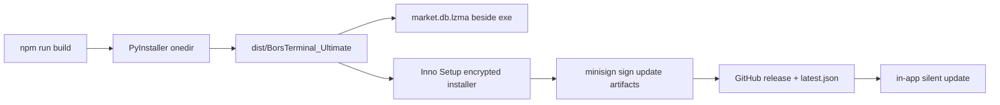

# bors-build-release — build and release pipeline

The release chain has several non-obvious contracts. Getting one wrong produces a build
that looks fine and an app that fails on the user's machine — or an update that silently
does nothing. This skill walks the chain in order.

## The chain



## 1. Frontend build

Run from `frontend/`: `npm run build` (Vite, output to `frontend/dist`).

- `base: '/'` — the SPA is served from the root by `app.py`, not from `/app/`. Changing
  this breaks every asset URL in the frozen build.
- The dev server proxies `/api` to `http://127.0.0.1:8001`.
- `sourcemap: false` in production builds.

## 2. PyInstaller — the onedir build

Entry point: [`scripts/build_all.py`](../../../Desktop/BorsTerminal/scripts/build_all.py:33).
Run from the repo root:

```
python scripts/build_all.py            # frontend + PyInstaller
python scripts/build_all.py --skip-npm # PyInstaller only, frontend already built
```

Two things in [`fts_terminal.spec`](../../../Desktop/BorsTerminal/fts_terminal.spec:16)
are easy to get wrong:

- **`hiddenimports` is load-bearing.** `api_router()` imports modules *inside function
  bodies*, so PyInstaller's static import scan cannot see them. Every `api/*.py` module is
  listed explicitly. **A new backend module that is not added here makes the EXE die with
  `ModuleNotFoundError` on the first request** — not at build time, not in dev, only in
  the shipped binary. This is the single most common release-breaking mistake.
- **`datas` uses a conditional list comprehension** for files that are gitignored and may
  or may not exist (`adb_config.json`, `codal_control.json`,
  `installer/.setup_password.iss`). The destination `'.'` is a *folder*, not a filename —
  `bors_entry._setup_password()` looks for `.setup_password.iss` in `_internal/`.

Also note: the spec uses `sys.executable` rather than a bare `python`, because a different
install on PATH can hold a stale `__pycache__` of the spec and make PyInstaller fail on
`datas` entries that were already removed.

`excludes` deliberately drops `playwright`, `camoufox`, `selenium`, `scipy`, `sympy`,
`matplotlib`, `boto3` — keep them excluded; they are fetcher fallbacks, not runtime deps.

## 3. The database contract

`market.db` raw is ~98 MB. It is **never** bundled inside the binary:

- Shipped compressed as `market.db.lzma`, placed **beside** the EXE by `build_all.py`.
- On first run, `bors_entry.py` preflight extracts it.
- Rationale: in a onefile build the whole archive would be re-extracted on every launch
  (tens of seconds of delay). The beside-exe pattern is deliberate, not an oversight.

If a build is missing the database, the app will start but serve no market data.

## 4. Inno Setup installer

[`installer/bors_setup.iss`](../../../Desktop/BorsTerminal/installer/bors_setup.iss:8):

- Payload is **encrypted** (`Encryption=yes`) and **password-protected**. The password
  comes from `installer/.setup_password.iss`, which is gitignored and read via `#include`.
- `PrivilegesRequired=lowest` with `PrivilegesRequiredOverridesAllowed="dialog commandline"`
  — this is required so the in-app updater can install silently with `/CURRENTUSER` and
  **no UAC prompt**. Without the `commandline` entry Inno ignores the flag and falls back
  to admin mode with a UAC dialog. Do not "simplify" these two lines.
- Default language is Farsi (`LanguageDetectionMethod=none` makes the first `[Languages]`
  entry the default).
- `ArchitecturesAllowed=x64compatible`.

If `.setup_password.iss` is absent, the in-app updater degrades from `/VERYSILENT` to
`/SILENT` and the user is prompted for the password once.

## 5. Signing and the two updaters

There are **two independent update mechanisms**. Do not merge them.

1. **Tauri updater** — pubkey embedded in
   [`frontend/src-tauri/tauri.conf.json`](../../../Desktop/BorsTerminal/frontend/src-tauri/tauri.conf.json:44),
   endpoint points at the GitHub release `latest.json`. `createUpdaterArtifacts` is on.
2. **In-app Python updater** — `api/update` + `bors_minisign.py`, which is why
   `bors_minisign.py` is explicitly bundled in the spec's `datas` (the static scan cannot
   see it either).

Signing keys (`*.tauri_updater_key*`) are gitignored. The **public** key is safe to commit;
the private key must never be on the build machine's tracked tree.

## 6. Publishing a release

Distribution is GitHub Releases — the updater endpoint is
`https://github.com/johnwarchief/BorsTerminal/releases/latest/download/latest.json`.

Checklist:

1. Version is bumped in **three** places that must agree:
   [`frontend/package.json`](../../../Desktop/BorsTerminal/frontend/package.json:4),
   [`frontend/src-tauri/tauri.conf.json`](../../../Desktop/BorsTerminal/frontend/src-tauri/tauri.conf.json:4),
   and `installer/bors_setup.iss` (`#define AppVersion`).
2. Build the full chain and confirm `dist/BorsTerminal_Ultimate/` exists.
3. Confirm `market.db.lzma` is beside the EXE.
4. Compile the Inno installer (needs the password include file present locally).
5. Sign the update artifacts with minisign.
6. Create the GitHub release and upload the installer **and** `latest.json`.
7. Verify by fetching `latest.json` from the release URL and checking the version matches.

## 7. Debugging a failed build/update

| Symptom | Likely cause |
|---|---|
| `ModuleNotFoundError` on first request in the EXE | New `api/*.py` module missing from `hiddenimports` |
| PyInstaller fails on a `datas` entry that was removed | Stale `__pycache__` of the spec — use `sys.executable`, or `--clean` |
| App starts, no market data | `market.db.lzma` not placed beside the EXE |
| Update prompts for a password | `.setup_password.iss` missing from the build |
| Update triggers UAC | `PrivilegesRequiredOverridesAllowed` lost its `commandline` entry |
| Asset 404s in the packaged app | `base` in `vite.config.ts` changed from `/` |
| Version mismatch in the updater | Only one of the three version files was bumped |

## Output format

When cutting a release, report the chain as a checklist with the artifact path and size
for each stage, plus the final `latest.json` verification result.
