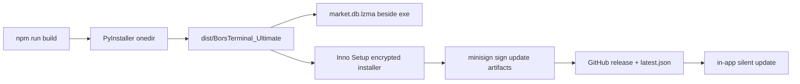

# bors-build-release — build and release pipeline

The release chain has several non-obvious contracts. Getting one wrong produces a build
that looks fine and an app that fails on the user's machine — or an update that silently
does nothing. This skill walks the chain in order.

## The chain



## 1. Frontend build

Run from `frontend/`: `npm run build` (Vite, output to `frontend/dist`).

- `base: '/'` — the SPA is served from the root by `app.py`, not from `/app/`. Changing
  this breaks every asset URL in the frozen build.
- The dev server proxies `/api` to `http://127.0.0.1:8001`.
- `sourcemap: false` in production builds.

## 2. PyInstaller — the onedir build

Entry point: [`scripts/build_all.py`](../../../Desktop/BorsTerminal/scripts/build_all.py:33).
Run from the repo root:

```
python scripts/build_all.py            # frontend + PyInstaller
python scripts/build_all.py --skip-npm # PyInstaller only, frontend already built
```

Two things in [`fts_terminal.spec`](../../../Desktop/BorsTerminal/fts_terminal.spec:16)
are easy to get wrong:

- **`hiddenimports` is load-bearing.** `api_router()` imports modules *inside function
  bodies*, so PyInstaller's static import scan cannot see them. Every `api/*.py` module is
  listed explicitly. **A new backend module that is not added here makes the EXE die with
  `ModuleNotFoundError` on the first request** — not at build time, not in dev, only in
  the shipped binary. This is the single most common release-breaking mistake.
- **`datas` uses a conditional list comprehension** for files that are gitignored and may
  or may not exist (`adb_config.json`, `codal_control.json`,
  `installer/.setup_password.iss`). The destination `'.'` is a *folder*, not a filename —
  `bors_entry._setup_password()` looks for `.setup_password.iss` in `_internal/`.

Also note: the spec uses `sys.executable` rather than a bare `python`, because a different
install on PATH can hold a stale `__pycache__` of the spec and make PyInstaller fail on
`datas` entries that were already removed.

`excludes` deliberately drops `playwright`, `camoufox`, `selenium`, `scipy`, `sympy`,
`matplotlib`, `boto3` — keep them excluded; they are fetcher fallbacks, not runtime deps.

## 3. The database contract

`market.db` raw is ~98 MB. It is **never** bundled inside the binary:

- Shipped compressed as `market.db.lzma`, placed **beside** the EXE by `build_all.py`.
- On first run, `bors_entry.py` preflight extracts it.
- Rationale: in a onefile build the whole archive would be re-extracted on every launch
  (tens of seconds of delay). The beside-exe pattern is deliberate, not an oversight.

If a build is missing the database, the app will start but serve no market data.

### The shipped database has an age, and CI reports it (DATA-AGE-1)

CI never *builds* data. `market.db.lzma` comes out of the git tree — packed on whichever
laptop last ran `release.ps1` — and `codal.db.lzma` is carried forward by
`publish_github_release.py` from the newest release that has the asset. Before this, a
UI-only release could therefore ship a board months behind and the in-app «بروزرسانی
دیتابیس کدال» button could serve a months-old snapshot, with nothing printed anywhere.

`scripts/check_release_db.py` now measures four Gregorian stamps —
`daily_prices.d_even` (last trading day), `daily_prices.fetched_at`,
`market_totals.updated_at`, `codal_notices.fetched_at` — with limits of 7/7/7/21 days:

- `--baseline` reads the **committed** `market.db.lzma` and is the step CI runs; it maps
  `AGE_STALE`/`AGE_UNKNOWN` lines to `::warning::` and notices when the step produced no
  verdict at all.
- Plain mode (called by `release.ps1`) validates structure and prints the age.
- **Stale data is a warning, never an abort.** Nowruz holidays and UI-only hotfixes are
  both legitimate; a gate that cries wolf gets `continue-on-error` added and then reads as
  noise. The one unconditional refusal is `PACK_REFUSED`: packing a `market.db` whose last
  trading day is *older than the committed baseline* would delete market days, so the pack
  stops and leaves the baseline bytes untouched (no `.bak`, no `.new`).
- Unknown is not zero and not stale: a missing table or NULL stamp prints `AGE_UNKNOWN`
  and does not count toward `STALE_COUNT`. Age never uses a Jalali field
  (`period_end`, `publish_date`, `monthly_sales.year`) because the repo has no trustworthy
  Jalali→Gregorian conversion, and a wrong conversion makes the day count a lie.
- `--strict` exists for the operator who *must* refresh data before this particular build.

`dev/data_age_release_guard.py` covers it with synthetic mini-databases, so it needs no
bank and runs green in CI. Extend it there rather than adding another live-data test.

## 4. Inno Setup installer

[`installer/bors_setup.iss`](../../../Desktop/BorsTerminal/installer/bors_setup.iss:8):

- Payload is **encrypted** (`Encryption=yes`) and **password-protected**. The password
  comes from `installer/.setup_password.iss`, which is gitignored and read via `#include`.
- `PrivilegesRequired=lowest` with `PrivilegesRequiredOverridesAllowed="dialog commandline"`
  — this is required so the in-app updater can install silently with `/CURRENTUSER` and
  **no UAC prompt**. Without the `commandline` entry Inno ignores the flag and falls back
  to admin mode with a UAC dialog. Do not "simplify" these two lines.
- Default language is Farsi (`LanguageDetectionMethod=none` makes the first `[Languages]`
  entry the default).
- `ArchitecturesAllowed=x64compatible`.

If `.setup_password.iss` is absent, the in-app updater degrades from `/VERYSILENT` to
`/SILENT` and the user is prompted for the password once.

## 5. Signing and the two updaters

There are **two independent update mechanisms**. Do not merge them.

1. **Tauri updater** — pubkey embedded in
   [`frontend/src-tauri/tauri.conf.json`](../../../Desktop/BorsTerminal/frontend/src-tauri/tauri.conf.json:44),
   endpoint points at the GitHub release `latest.json`. `createUpdaterArtifacts` is on.
2. **In-app Python updater** — `api/update` + `bors_minisign.py`, which is why
   `bors_minisign.py` is explicitly bundled in the spec's `datas` (the static scan cannot
   see it either).

Signing keys (`*.tauri_updater_key*`) are gitignored. The **public** key is safe to commit;
the private key must never be on the build machine's tracked tree.

## 6. Publishing a release — CI does it, not the laptop

Two repos are involved: the **private source mirror** `johnwarchief/BorsTerminal-src`
(local remote `github`, where CI runs) and the **public distribution repo**
`johnwarchief/BorsTerminal`, where releases live and where the updater endpoint points:
`https://github.com/johnwarchief/BorsTerminal/releases/latest/download/latest.json`.
Pushing a tag to the mirror is the whole release procedure:

```
python scripts/check_release_db.py --pack                 # refresh the data baseline first
git add market.db.lzma && git commit -m "data: market.db.lzma baseline"
python dev/version_anchor_guard.py                      # must print "VERSION ANCHOR GUARD OK"
git push github main
git tag -a -f vX.Y.Z -m "vX.Y.Z" && git push -f github vX.Y.Z
gh run watch --repo johnwarchief/BorsTerminal-src --workflow release.yml
```

A tag built on an old `market.db.lzma` ships an old board: CI copies the committed
baseline forward and cannot fetch anything. `codal.db.lzma` likewise needs
`python scripts/build_codal_snapshot.py` + a manual upload when its age warning fires.

The `release-inno` job runs on `windows-latest`: `build_all.py` under **Python 3.12** →
ISCC with `/DAppVersion=<tag>` → `npx tauri signer sign` → **Build Delta Patch** →
`scripts/publish_github_release.py`, which creates the release on the public repo using
`RELEASE_TOKEN` (the default CI token cannot write there) and uploads installer + `.sig`
+ patch + `latest.json`.

**Six version checks across five files must agree**, and `dev/version_anchor_guard.py` is a
CI gate that fails the run otherwise: `bors_config.APP_VERSION`, `frontend/package.json`,
`frontend/package-lock.json` (`version` **and** `packages[""].version` — the two that get
missed), `frontend/src-tauri/tauri.conf.json`, `installer/bors_setup.iss` (`#define
AppVersion`). Run the guard *after* the bump; a green guard from before it proves nothing
(v1.0.23's first CI run went red for exactly this reason).

The publisher then re-downloads every asset it uploaded from its own release URL, compares
SHA-256 against the local file, verifies the minisign signature against
`api/update.UPDATE_PUBKEY` (the very key the in-app updater trusts), and checks that
`releases/latest/download/latest.json` reports the tag. It exits 1 *after* the assets are
already live, so a red publish step means "inspect the release", not "nothing shipped".
Motive: v1.0.22 shipped stale exe+sig bytes handed over by a sync mount.

**The delta patch is CI-only, and diffs against a file manifest.** Every build publishes
`dist/BorsTerminal_Manifest_v<tag>.json` (relpath → sha256, same user-state exclusions)
beside the installer; the next release's patch step downloads that manifest and runs
`make_patch.py --from <prev> --baseline-manifest …`, refusing to build if the manifest's
version ≠ `--from`. It falls back to downloading and silently *installing* the previous
installer only for releases that predate manifests, and that fallback is fragile: the
released v1.0.22 installer installs cleanly on the dev machine (exit 0) while the runner,
with the very password the runner itself compiled into v1.0.23, gets
«گذرواژه وارد شده اشتباه است» → exit 1. Never hand-build a patch to ship: a tree that has
run the app once carries that machine's `.screener_cache.json` and `market.db.baseline`
into the zip (both now excluded), and a local interpreter different from CI's inflates the
delta to ~55 MB.

**`continue-on-error` hides failure.** A step that fails while continue-on-error is set
still reports `conclusion: success` through the Actions API, and the runner's Azure blob
logs are unreachable from this network — that combination is why v1.0.23 went out three
times "green" with no patch. The patch step now emits `::notice::` / `::error::` markers
for every stage (resolved tags, chosen source version, download size, `make_patch` exit
code plus its log tail, artifact size). Read them with:

```
gh api repos/johnwarchief/BorsTerminal-src/check-runs/<job-id>/annotations
```

Use that pattern for any step whose silence would be expensive. If users are promised a
small update, verify `patches` in the live `latest.json` — do not trust step colors.

**Proving a delta on a real client (done for 1.0.23 → 1.0.24 on 2026-09-25).** Against the
running installed app, in order: `GET /api/update/check` must return `"delta": true` and the
patch URL (not the installer); `POST /api/update/download` then poll `GET /api/update/progress`
to `"ready"`; hash the temp copy under `%TEMP%\bors_update\` and compare with an independent
download of the same asset — that is what catches a stale-mount or truncated upload; verify the
`.sig` with `bors_minisign.verify_minisign(data, sig, api.update.UPDATE_PUBKEY)`; then
`POST /api/update/install`, which spawns the install's own `apply_update.bat` and exits the app.
Success looks like: process relaunched with a new PID, `GET /api/update/version` = the new
version, `Version.txt` stamped `app_version` / `patch_from` / `git_commit`, and the user's
`user.db` + `.screener_cache.json` unchanged in both size and mtime. A manifest-diffed release
of frontend-only changes lands ~20 changed files of ~1,543 → a 12.4 MB patch behind a 56.9 MB
installer.

**`codal.db.lzma` + `.sig` must be on the newest release.** `api/_sync_codal.py` fetches
`releases/latest/download/codal.db.lzma`, so any release lacking that asset breaks the
in-app «بروزرسانی دیتابیس کدال» button with a 404 — that is what happened the moment
v1.0.23 became `latest`. The snapshot is gitignored and never built in CI, so the publisher
copies it forward from the newest release that carries it; refresh it deliberately with
`python scripts/build_codal_snapshot.py` then `python scripts/sign_setup.py codal.db.lzma`
and attach both when the Codal data itself moves.

Local builds stay the way to *test* before shipping: `python scripts/build_all.py`, then
the installer in `installer/out/`.

## 7. Debugging a failed build/update

| Symptom | Likely cause |
|---|---|
| `ModuleNotFoundError` on first request in the EXE | New `api/*.py` module missing from `hiddenimports` |
| PyInstaller fails on a `datas` entry that was removed | Stale `__pycache__` of the spec — use `sys.executable`, or `--clean` |
| App starts, no market data | `market.db.lzma` not placed beside the EXE |
| Update prompts for a password | `.setup_password.iss` missing from the build |
| Update triggers UAC | `PrivilegesRequiredOverridesAllowed` lost its `commandline` entry |
| Asset 404s in the packaged app | `base` in `vite.config.ts` changed from `/` |
| Version mismatch in the updater | Only some of the six version anchors were bumped — run `dev/version_anchor_guard.py` |
| Every CI step green but no `patches` in `latest.json` | `continue-on-error` masks the real failure — read `check-runs/<job-id>/annotations`, not step conclusions |
| Patch step: `نصبِ باس‌لاین exit=1` with «گذرواژه وارد شده اشتباه است» | That release predates file manifests; the install fallback is environment-fragile. Publish `BorsTerminal_Manifest_v<prev>.json` for it instead |
| «بروزرسانی دیتابیس کدال» button 404s | `codal.db.lzma` + `.sig` are not on the *newest* release (`latest` resolves to it) |
| Release assets missing entirely | `release-inno` publishes to the public repo — `RELEASE_TOKEN` must have access to both repos |
| Local patch is ~55 MB instead of ~12 MB | Built with a different Python than CI's 3.12 — patches are CI-only |
| `UnicodeEncodeError` on a local Persian print | Console is cp1252 — run with `PYTHONIOENCODING=utf-8`; CI is UTF-8 and unaffected |

## Output format

When cutting a release, report the chain as a checklist with the artifact path and size
for each stage, plus the final `latest.json` verification result.
